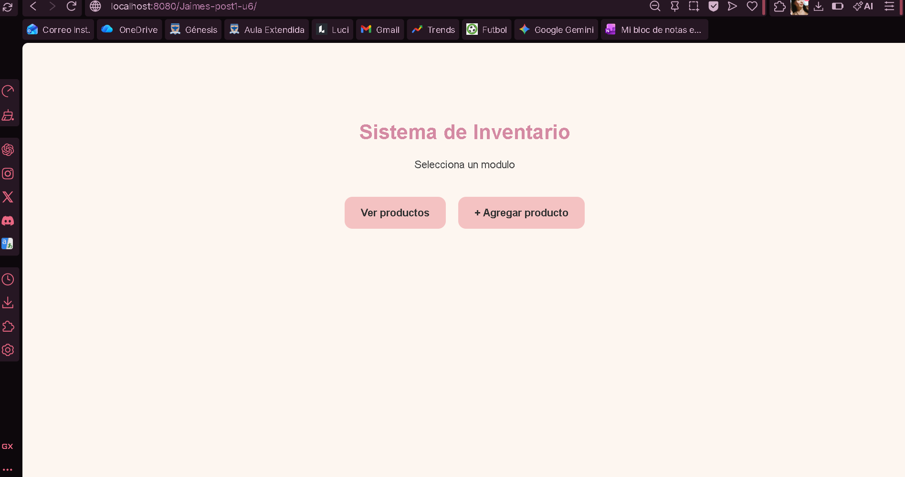
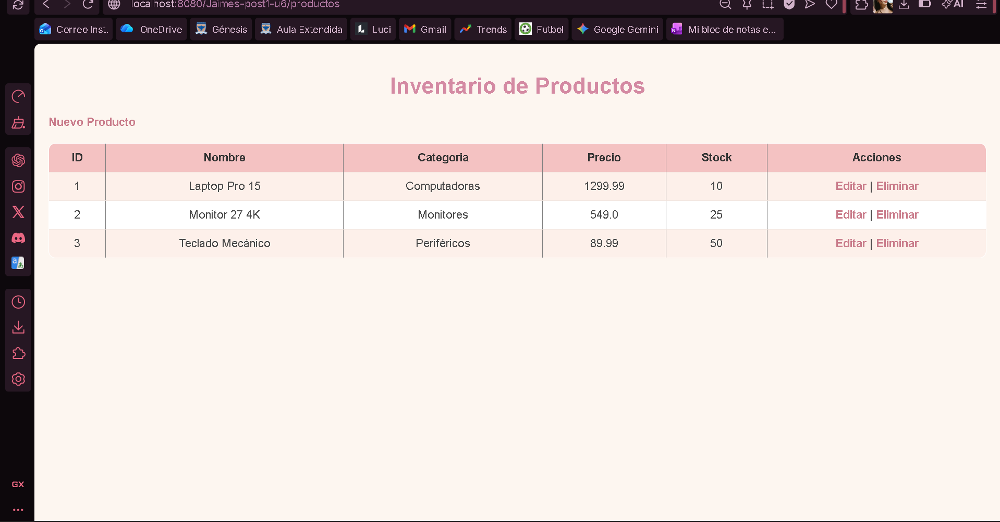
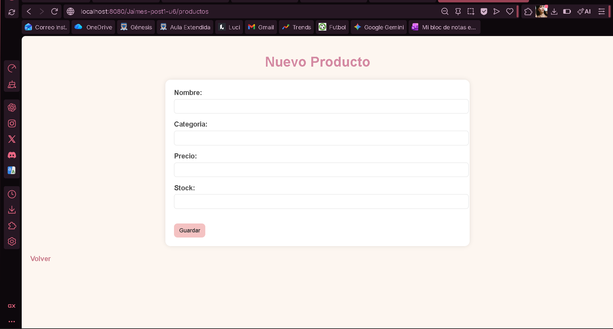
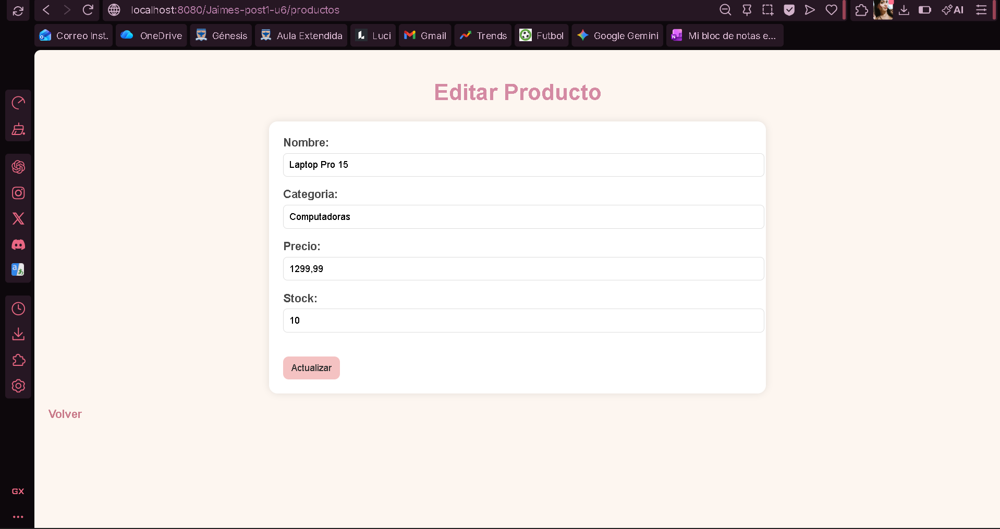
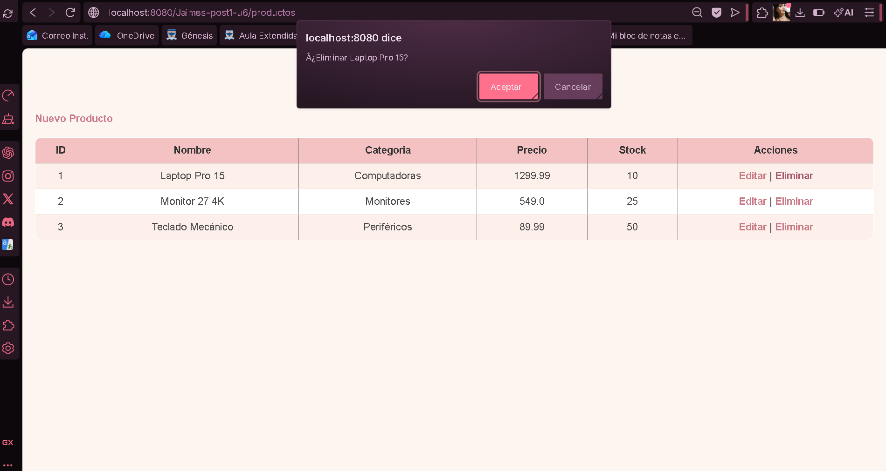
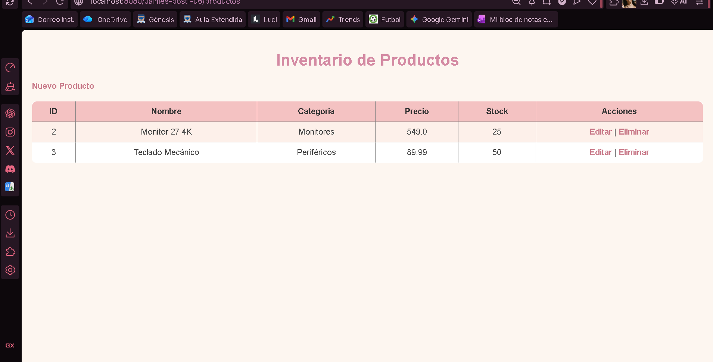

# Proyecto MVC - CRUD de Productos en Java Web

Este proyecto es una aplicación web desarrollada en Java utilizando el patrón de arquitectura MVC (Modelo, Vista, Controlador). Permite gestionar un inventario de productos con operaciones básicas como listar, crear, editar y eliminar.

---

## Tecnologías utilizadas

- Java 11 o superior  
- Jakarta Servlet / JSP  
- JSTL  
- Apache Tomcat 10.1.54  
- Maven  
- HTML, CSS  
- IntelliJ IDEA / Eclipse  


## Estructura del proyecto

El proyecto está organizado siguiendo el patrón MVC:

- **Model**: contiene la entidad Producto y el acceso a datos (DAO)  
- **Service**: maneja la lógica de negocio  
- **Controller**: gestiona las peticiones HTTP (Servlet)  
- **View**: páginas JSP con JSTL y Expression Language  


## Funcionalidades

- Listar productos  
- Registrar nuevos productos  
- Editar productos existentes  
- Eliminar productos  
- Validación básica de datos  
- Redirección Post/Redirect/Get para evitar duplicidad  


## Cómo ejecutar el proyecto

1. Clonar el repositorio:

```bash
git clone https://github.com/tuusuario/tu-repositorio.git
````

2. Abrir el proyecto en IntelliJ IDEA o Eclipse

3. Verificar que Maven descargue las dependencias

4. Configurar Apache Tomcat 10.1.54 en el IDE

5. Ejecutar el proyecto en el servidor

6. Abrir en el navegador:

```
http://localhost:8080/Jaimes-post1-u6/
```


## Capturas de pantalla

Agregar aquí las imágenes del funcionamiento del sistema:
* Vista principal



* Lista de productos



* Formulario de registro



* Edición de productos



* Eliminación





##  Flujo del sistema (MVC)

1. El usuario realiza una petición desde el navegador
2. El Servlet (Controller) recibe la petición
3. Se comunica con el Service (lógica de negocio)
4. El DAO maneja los datos en memoria
5. Se envían los datos a la Vista (JSP)
6. Se muestra la respuesta al usuario


## Notas importantes

* El proyecto no utiliza base de datos, los datos se almacenan en memoria
* Se implementa patrón MVC correctamente separado por capas
* Se usa Post/Redirect/Get para evitar reenvío de formularios


##  Autor
 Oriana Jaimes
 
 Estudiante de ingenieria de sistemas
